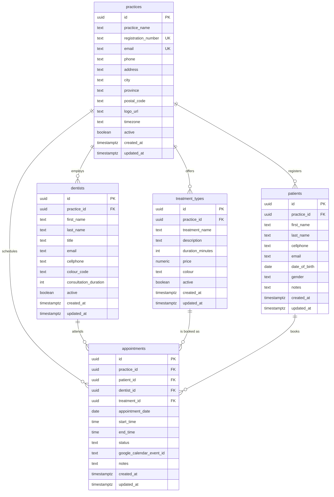

# Database Schema

Migrations live in [`migrations/`](migrations/) and apply in filename order.

## ER Diagram

## Relationships

- **practices → dentists, treatment_types, patients, appointments** (1-to-many):
  `practices` is the tenant root. Every other table carries a `practice_id`
  foreign key with `on delete cascade`, so removing a practice removes its
  dentists, treatment types and patients (appointments block this — see
  below).
- **dentists → appointments**, **treatment_types → appointments**,
  **patients → appointments** (1-to-many): an appointment always names one
  patient, one dentist and one treatment type.
- **Composite tenant-safety FKs**: `dentists`, `treatment_types` and
  `patients` each carry a `unique (id, practice_id)` constraint. `appointments`
  references them via `(dentist_id, practice_id)`, `(treatment_id,
  practice_id)` and `(patient_id, practice_id)` instead of plain `id`
  foreign keys. This makes it impossible — at the schema level, not just in
  application code — to attach a patient, dentist or treatment from one
  practice to an appointment belonging to another practice.
- **Delete behavior**: appointments reference patients/dentists/treatment
  types with `on delete restrict`, so a record with appointment history
  can't be hard-deleted; use the `active` flag to retire it instead. This
  also means a practice with any appointment history can't be cascade
  deleted until that history is cleared.

## Multi-tenancy & RLS

Every table has Row Level Security enabled. Access is scoped by
`public.current_practice_id()`, which reads `practice_id` out of the
caller's JWT `app_metadata` — the same claim a future auth/onboarding
milestone will populate when a staff account is provisioned. Until that
claim exists, the tenant-scoped policies deny access by default (no
`practice_id` in the token → no matching rows).

- `practices`: members can `select`/`update` only their own row. There is
  no `insert`/`delete` policy — provisioning a new practice is a
  `service_role` operation (which bypasses RLS), handled by the future
  onboarding flow.
- `dentists`, `treatment_types`, `patients`, `appointments`: one `for all`
  policy per table restricts every action to rows where `practice_id`
  matches the caller's practice.

## Data integrity notes

- `gen_random_uuid()` (via `pgcrypto`) generates all primary keys.
- Every table has `created_at`/`updated_at`; a shared `set_updated_at()`
  trigger keeps `updated_at` current on every row update.
- `appointments.status` is constrained to `booked`, `confirmed`,
  `completed`, `cancelled`, `no_show`.
- `appointments.end_time` must be later than `start_time`.
- `dentists.colour_code` and `treatment_types.colour` must be `#RRGGBB` hex.
- `treatment_types.duration_minutes` and `.price`, and
  `dentists.consultation_duration`, are constrained to positive values.
- `appointments.google_calendar_event_id` is unique when present, so one
  calendar event can't back two appointments.

Out of scope for this milestone: no double-booking/overlap prevention, no
auth/staff tables, no seed data — those belong to later milestones.
